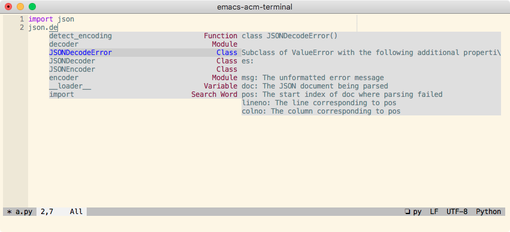

# acm-terminal

Patch for LSP bridge acm on Terminal.



## Requirements

- [lsp-bridge](https://github.com/manateelazycat/lsp-bridge) 75b3704(2022-10-02) or newer
- [popon](https://codeberg.org/akib/emacs-popon)

## Installation

Clone or download this repository (path of the folder is the `<path-to-acm-terminal>` used below).

## Configuration

```emacs-lisp
(require 'yasnippet)
(yas-global-mode 1)

(require 'lsp-bridge)
(global-lsp-bridge-mode)

(unless (display-graphic-p)
  (add-to-list 'load-path "<path-to-acm-terminal>")
  (with-eval-after-load 'acm
    (require 'acm-terminal)))
```
